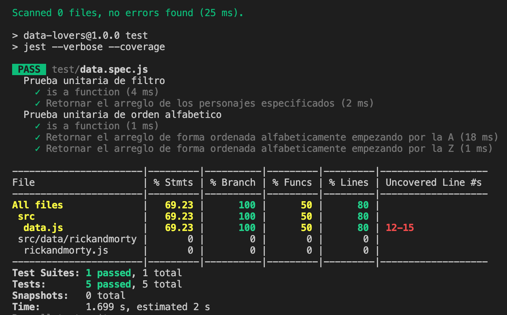

# Data Lovers

## Índice

* [1. Resumen del proyecto](#1-resumen-del-proyecto)
* [2. Objetivos de aprendizaje](#2-objetivos-de-aprendizaje)
* [4. Consideraciones generales](#4-consideraciones-generales)
* [5. Criterios de aceptación mínimos del proyecto](#5-criterios-de-aceptación-mínimos-del-proyecto)
* [6. Consideraciones técnicas](#6-consideraciones-técnicas)
* [7. Pistas, tips y lecturas complementarias](#7-pistas-tips-y-lecturas-complementarias)

## 1. Resumen del proyecto

Este proyecto tiene como obajetivo mostrar un listado de personajes a partir de la data que es sobre Rick And Morty,
en base a eso crear interaciones para el usurio como ordenar alfabeticamente, filtrar por criterios de interes para el usario
y buscar personajes mediante su nombre.

%2011.21.09.png)
## 2. Prototipos

Procesos de creacion del prototipo de baja fidelidad: Siempre se penso en mostar la imagen de los personajes, en cuanto pasara el usuario el cursor se mostran los datos. 

Proceso de creacion de prototipo de alta fidelidad: En este prototipo se trabajo ya realizando las historia de usario que fueron ciertas caracteristicas: Mostrar los personajes imagen, nombres y especie, Tener una opcion de filtrado, Opcion de orden Alfabetico y Opcion de Busqueda.

## 3. Historia de usuario

* HU1:Yo como usuaria de Rick And Morty quiero ver los personajes que aparecen en la serie par identificarlos y saber la información, sin ningun orden en especifico.
* HU2: Yo como usuaria de rick And Morty quiero filtrar a los personajes que aparecen en la serie, segun algun estatus para conocer diferentes personajes que salen en la serie.
* HU3: Yo como usuaria de Rick And Morty quiero ordenar a los personajes que aparecen en la serie, para para identificarlos mas rápido.
* HU4: Yo como usuaria de Rick And Morty quiero buscar a los personajes que aparecen en la serie, ya sea por su nombre para poder identificarlos según su criterio.

## 4. Pruebas unitarias

Se redactaron y se ejecutaron pruebas unitarias para las funciones de filtrado y ordenamiento del sitio.

Visita el sitio atraves de [Github Page](https://elsycaro.github.io/CDMX013-data-lovers/) 
